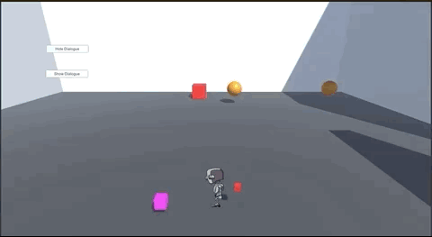
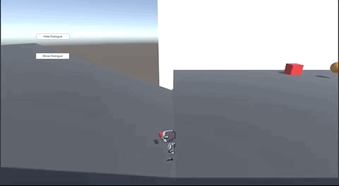
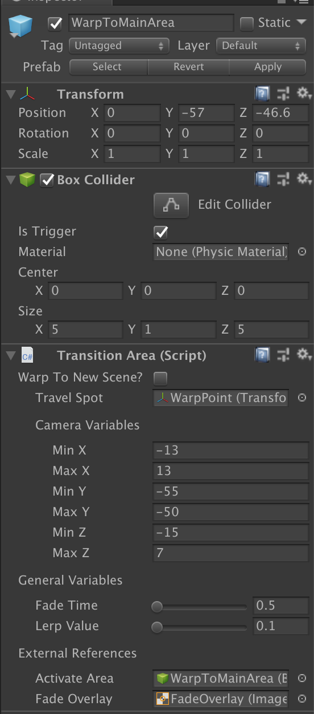
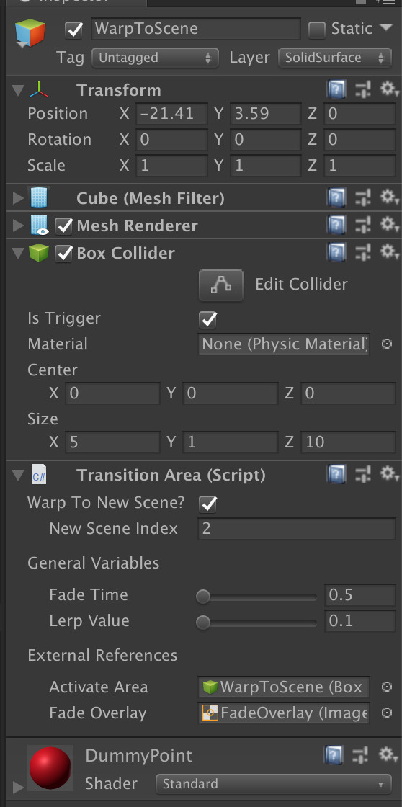
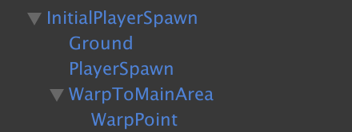

# Area Transitions
This documentation outlines how the player transitions from one are to the next area.

## Summary

When the player approaches a specific area, the following will always happen:
1. The screen will fade to black
2. The player will be unable to move
3. The screen will fade back, and the player will be allowed to move again.

However, the main difference will be where the player ends up afterwards.
- If the `AreaTransition` area is set to go to a __different area__, you will be warped to a new area.
- If the `AreaTransition` area is set to go to a __new scene__, the following will happen instead:

  - 

    1. The player will see the `LoadingScreen`, where it will visually show how long it will take to load in the level.
    2. Once the level is done loading, the screen will fade to black again before fading out into the new scene.

## Component Inspector
The main component at work, `Transition Area` controls how the player will move about in the game. This component is unique in that depending on the value of `Warp To New Scene`, various sections of the component will either be hidden or visible.

In either example, they both share the same variables in:
- `Fade Time`: The amount of time it takes to fade in and fade out of the transition.
- `Lerp Value`: How quickly does the screen turn from black to transparent and vice verse.
- `Activate Area`: A reference to the trigger box that is used to activate the cutscene.
- `Fade Overlay`: A reference to the `Image` that is used to perform the fade in and fade out effect.

In the example above, this is the default configuration for the component, which is set to sending the player to a new location in the current scene.
  - `Travel Spot`: The GameObject that dictates the location of where the player will be placed after the travel cutscene takes place.
  - `Camera Variables`: All of the variables defined here dictate the new bounding box of the `Main Camera`. In other words, this prevents the camera from being moved past the specified ranges.

In this example, we toggled `Warp To New Scene` to be true, changing the variables that are currently displayed.
- `New Scene Index`: The build index of the scene that the player will travel to.

## Initial Spawn Prefab
When the player is first spawned in a level, the following occurs:
1. Is there already a player GameObject existing?
  - If not, we automatically spawn one and move them to the `PlayerSpawn` position.
  - If there exists a player GameObject, we simply move them to the `PlayerSpawn` position.
2. The player will then hit `WarpToMainArea` and be then moved to the actual level.
> Note: The second step is done because we need to potentially have some time in setting up the player and main camera. We also do it so that we can have a clean transition into the level.

  - `PlayerSpawn`: This is the GameObject that the player will be spawned
  - `WarpToMainArea`: This is a warp point that takes the player to the actual area where they need to be warped into the level, as defined at the `WarpPoint` GameObject.
