# Battle System Documentation
This guide will go over how this game's battle system operates (WIP)

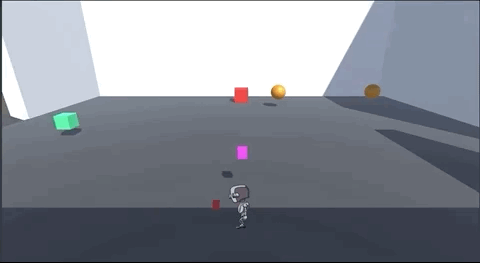

## Overview
Battles in this game will be primarily turn based. The turn order for who goes first will depend on the entity's `speed` stat. In order to win a battle, the player must defeat all of the enemies using attacks. The player loses if all of their party members are defeated by the enemies's attack.

## Initiating Combat
In the game, battles can be started by two kinds of events:
1. Interacting with a `DialogueEvent`
2. Activating one via a trigger 

### Activating via `DialogueEvent`
At the end of a dialogue, a special event called a `BattleEvent` will be activted, transitioning the player to the battle arena. This event MUST be placed in the End Event Actions section of a dialogue.

### Activating via a Trigger
Another potental way to activate an event is to have the player walk into a trigger box, which will then activate the battle. No dialogue will be played.

## `BattleEvent` Object
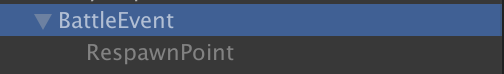
- This outlines what exactly goes into the special `BattleEvent` object. Things to note:
  - This object is normally deactivated upon startup.
  - The object has a single child that is used to place the player back into the scene once the fight has concluded.

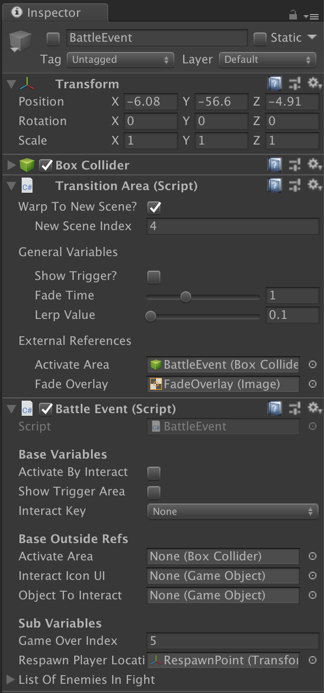
- This outlines what variables goes into the object in order to properly configure it as needed.
- This event primarily uses two components:
  - `TransitionArea`
    - Simply make sure that the following are filled:
        - `WarpToNewArea`: true
        - `NewSceneIndex`: The scene index that has the battle logic
  - `BattleEvent`:
    - `GameOverIndex`: The scene index that the Game Over scene is at.
    - `RespawnPlayerLocation`: Reference to the child object of the event that determines where the player will be place after the battle. __SHOULD BE SOMEWHERE NOT IN A BATTLE TRIGGER__.
    - `ListOfEnemiesInFight`: A list of all of the `EnemyData` objects that have been made in the database that will be spawned for the fight.

## Battle UI
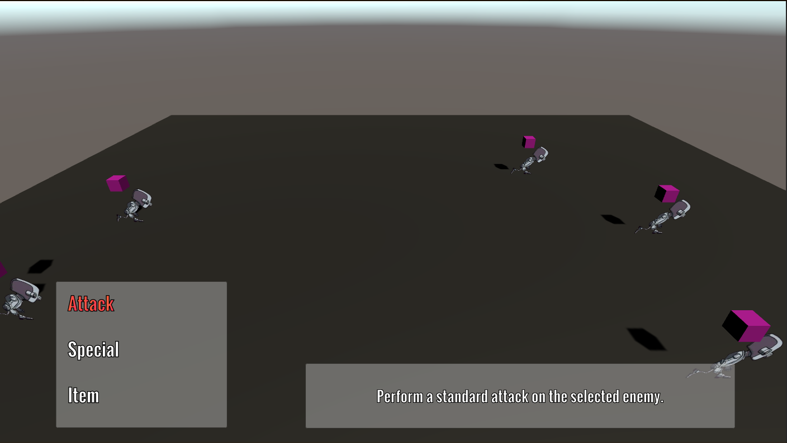

The battle hud appears when it is the player's turn to attack. Here, the player can select from the following three options:
- `Attack`: The player uses a move that does not cost any SP or HP to perform. It is inherantly weaker than other moves and deals physical contact damage.
- `Special`: The player selects a unique move that is stronger than the standard `Attack` option. These tend to have different properties and varying attack powers. However, each of these moves use up SP/HP.
- `Item`: The player selects an item from their inventory to use on the party. These tend to restore either HP/SP, but they use up the player's action.

### Selecting an Attack Option
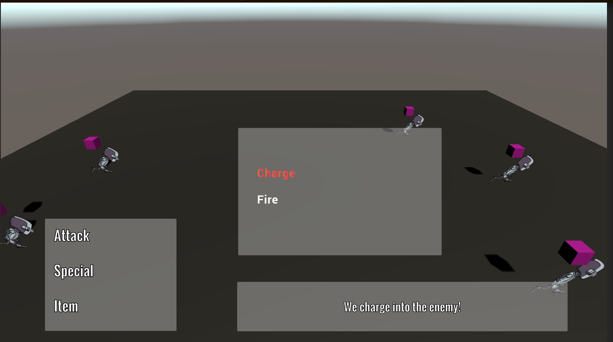

__WIP__. This is what the `Special` menu looks like. Here, the player will be able to get a glimpse of what moves are available, how much SP/HP it costs to use them, and a short description of what it does.

### Selecting a Target Option
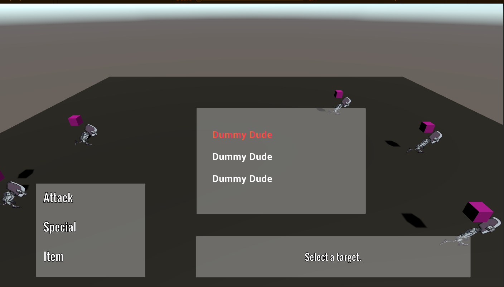

__WIP__. This is what selecting an enemy target looks like. This shows how much HP the enemy has left as well as showing what available targets are left.

### Selecting an Item Option


__WIP__. This is what selecting an item looks like. This will show the effect of the item as well as visually displaying how much of one item a player has.

### Selecting a Party Target
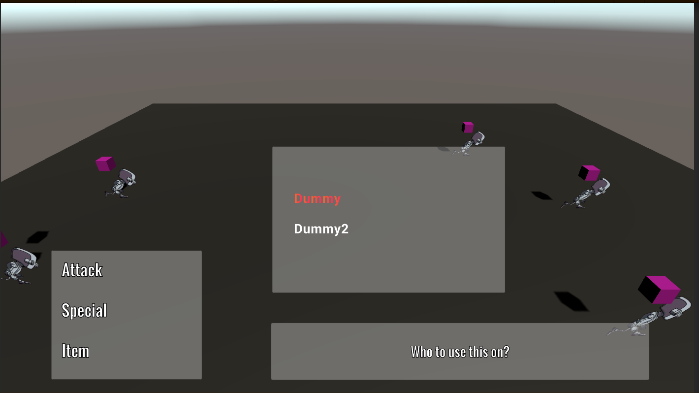

__WIP__. This is what selecting a target to use said item will look like. This will not only be updated to show what available targets are available, but it will also show each party member's HP/SP totals.

## Battle Flow
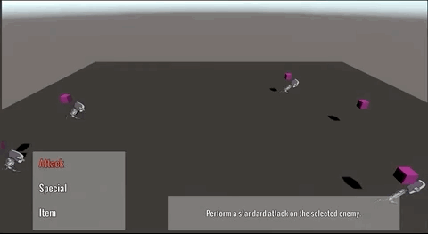

All battles are divided up into two main fronts: Player Phase and Enemy Phase. To determine who's turn is it, refer to the _orange block_ that is hovering over the entity.
  - Player Phase: The player can select a battle option to enact on for that one entity. Once the player has selected an option, that entity will play out its action and end its turn.
  - Enemy Phase: The enemy (randomly) selects a target and a move to attack the player. This will change in that the enemy will have some kind of pattern to follow when making decisions. Once an enemy has finished attacking, its turn ends.

### Enemy Entity Lost All HP
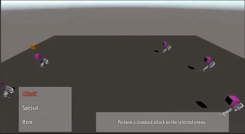

When a player hits an enemy for mortal damage, the enemy is defeated. It is taken out of the battle and out of the turn order.

### Player Entity Lose All HP
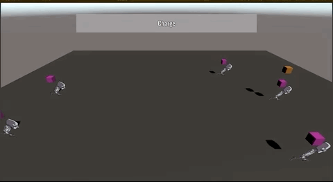

When an enemy hits a player party member for mortal damage, the affected party member is defeated. Like the enemy, the party member is out of the fight and out of the turn order.

### Enemy Loses, Player Wins
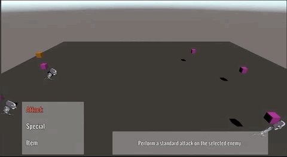

__WIP__. When all of the enemeis are gone, the player wins, gaining EXP, gold and items from the fight. Level ups will also occur here as well. Then, the player is taken back to their original scene.

### Player Loses, Enemy Wins
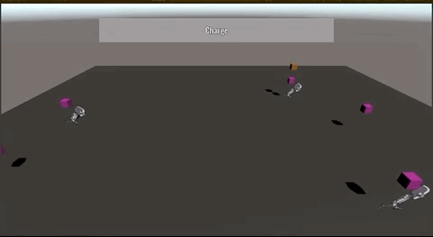

If all of the player's party members are gone, the player is taken to a game over screen, where they will have to reload from an earlier save state.

## Affinity System
Every move in the game has some sort of affinity attached to it. Here is a list of all of the affinities that are available in the game:
```
0: CONTACT
1: FIRE
2: ICE
3: WIND
4: THUNDER
5: LIGHT
6: DARK
7: ALMIGHTY
```
> All of these are associcated with an index value, which is used primarily in the coding of the game. 

### Bonus Damage/Penalty
Every entity in the game has a specific affiliation with the above affinities. Depending on how they are specified, the entiry can either take extra or less damage from specific attack types. Here is a list of all of the potental affiliations:
- `NORMAL`: The attack has no added modifier to it
- `WEAK`: The attack does 2x the damage to the entity when receiving damage of this type.
- `RESISTANCE`: The attack does 1/2 damage to the entity when receiving damage of this type.
- `NULL`: The attack does NO damage to the entity when receiving damage of this type
- `REFLECT`: The attack not only does NO damage to the entity, but it also sends tha damage back to the attacker. This reflected damage WILL take into account the attacker's affliliations
- `ABSORB`: The attack not only does NO damage to the entity, but it insteads heals them for the damage that would have been done normally.
