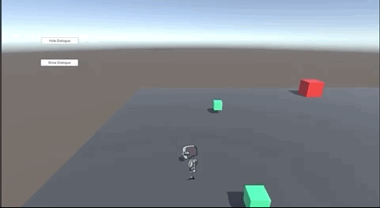
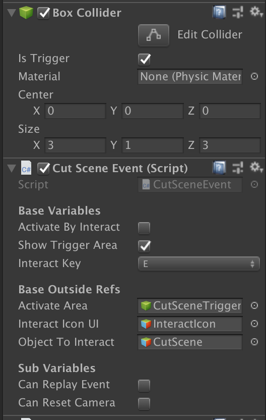
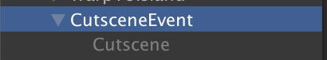
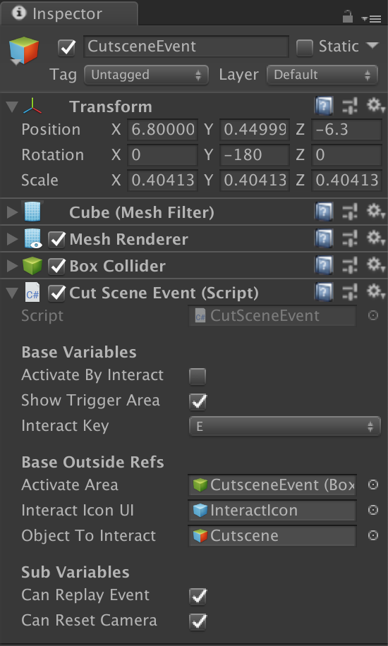
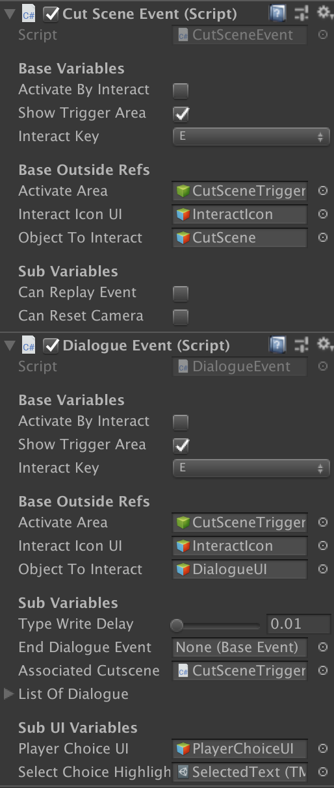
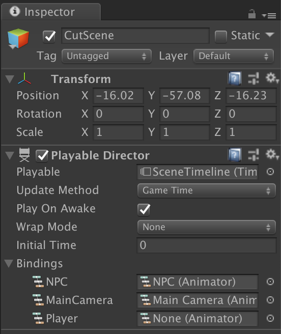
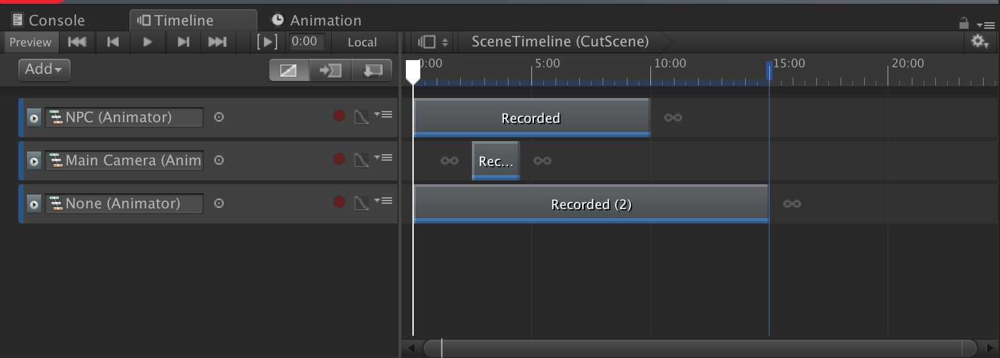

# Cutscenes
This documentation goes over how cutscenes are handled in the game.

## Summary

Cutscenes are scripted events done in Unity's Timeline feature (introduced in Unity 2017), where the camera, player and other game objects move in a predetermined path. Many things can be done through this, such as dialogue with character movement and camera pan shots.

There are two kinds of cutscenes that can be done:
  1. Cutscenes in the current level
  2. Cutscenes in a separate area.

Along with these two types, all cutscenes require the following components:

- A `Box Collider` that is a `trigger`
- A `CutSceneEvent` component

### Cutscenes in Same level
These cutscenes are best used for when the game wants to showcase a specific area or a small Game Object interaction. These type of cutscenes can be broken down into this specific Game Object:

#### Main Differences
- `Object To Interact`: Takes a GameObject that has a `Playable Directive` component on it.
  - This GameObject holds all of the logic that goes into playing out all of the movement performed in the cutscene.

##### Variables
- `Can Replay Event`: This is a flag that allows for this cutscene to be repeated after it is executed.
- `Can Reset Camera`: This flag resets the camera to be what it was prior to activating the event.

### Cutscenes in Another Level
These cutscenes are best used when the game wants to showcase a more complex scene, that is often followed up with dialogue.

To achieve this setup, the main trigger for this can look like the following:

- A `CutSceneEvent` component
- A `DialogueEvent` component (This can be optional _IF_ the cutscene you are making does NOT have any dialogue in it)

#### Main Differences
- Like the previous cutscene, `Object To Interact` takes a GameObject that has a `Playable Directive` component on it.
- If there's a `DialogueEvent`:
  - Need to attach this `CutsceneEvent` GameObject into the `Associated Cutscene` field.
  - For any associated `DialogueNodes`, need to specify the `DelayTime` to tell how long the cutscene may go on before showing that specific dialogue.

#### Variables
- All of the variables remained the same as the previous cutscene, BUT in this case, these values should remain __FALSE__, since the cutscene itself will handle everything.

## How to use
In order to set up a cutscene, the following steps will have to be done:
1. Determine if the cutscene will happen in the same level or in a new area.
    - If it is in the same level:
      1. Create the GameObject that will act as the trigger for the cutscene as described in the section, `Cutscene In Same Level`
      2. Create a GameObject that will have the `PlayableDirector` component on it and attach it to the `CutSceneEvent` component.
      3. __MAKE SURE THE GAMEOBJECT THAT YOU ATTACHED IS INACTIVE__
    - If it is in a different level
      1. Create a `TransitionArea` trigger in the level where you want the player to move towards in order to activate it.
      2. Create a new Scene and set it up accordingly. This scene _MUST_ contain the following:
          - A `PlayerSpawn` GameObject that is tagged `PlayerSpawn`
          - A `Trigger` that has `CutSceneEvent` and/or `DialogueEvent` component properly configured
          - A `Trigger` that has the `TransitionArea` component on it
      3. Create and associate the `CutScene` Object that has the `PlayableDirector` assocuated with the `CutSceneEvent` component

      > In the cutscene, the player __NEEDS__ to have some way of entering the `TransitionArea` component so that they are able to move back to the original scene. This can be handled either by directly scripting the player to move towards that cutscene, or having the `TransitionArea` trigger be spawned on top of the player.

## Timeline

This GameObject is what controls all of the actions that are done within the Cutscene. This object needs to be properly set up with the proper movement before a cutscene can take place.

This outlines all of the actions and GameObjects that will be participating in the cutscene. For a detailed example of how this works, refer to the `CutScene Test` Scene.

>NOTE: In all cutscenes that involve the player, one of the tracks in the Timeline __MUST__ be named `Player` in order to properly script the player movement. 
