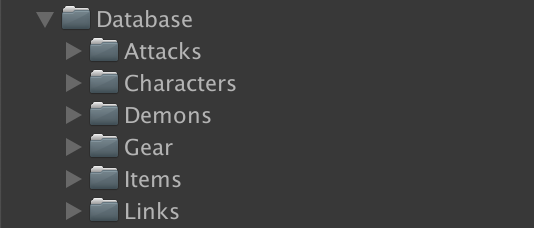
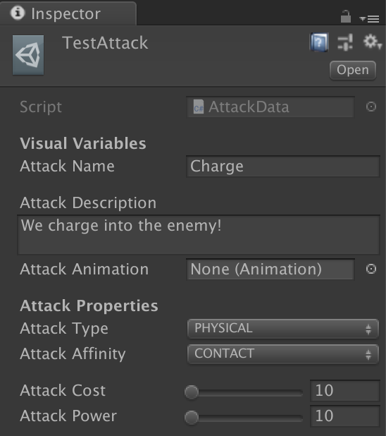
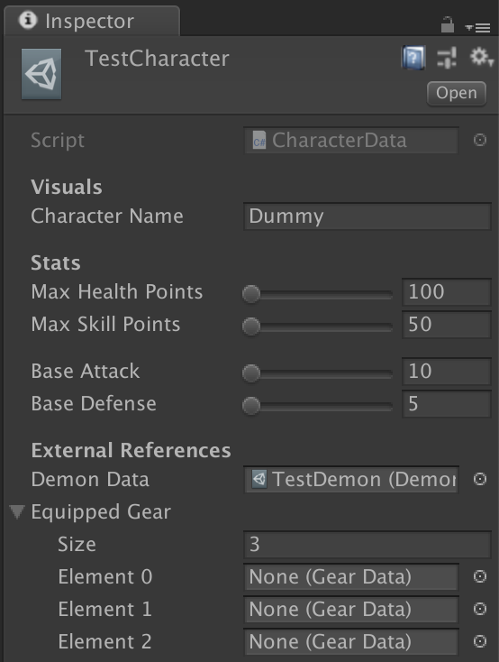
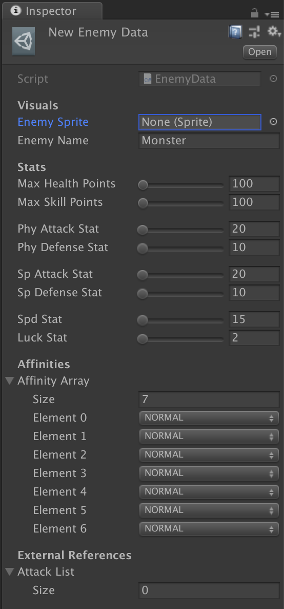
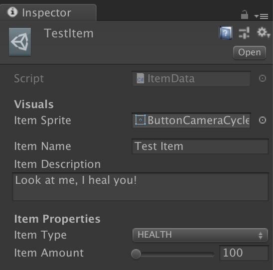
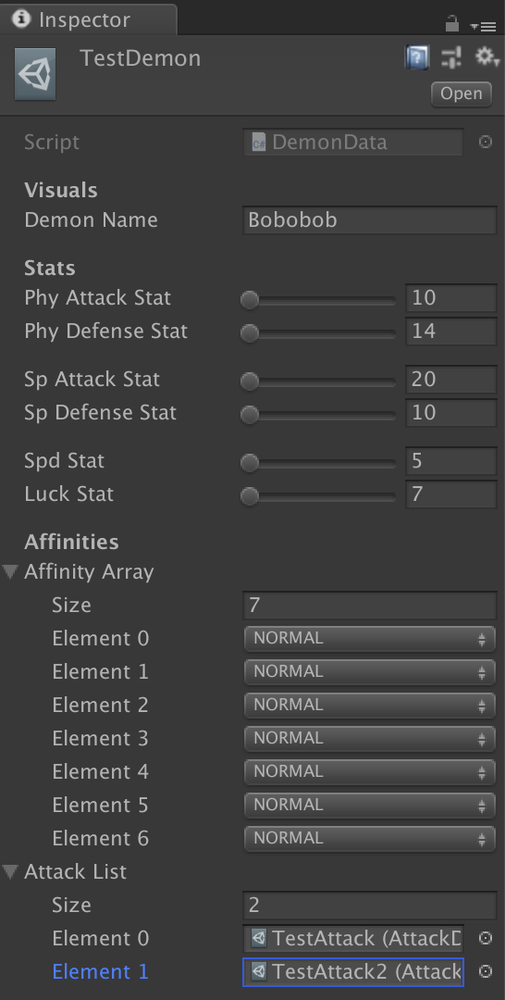
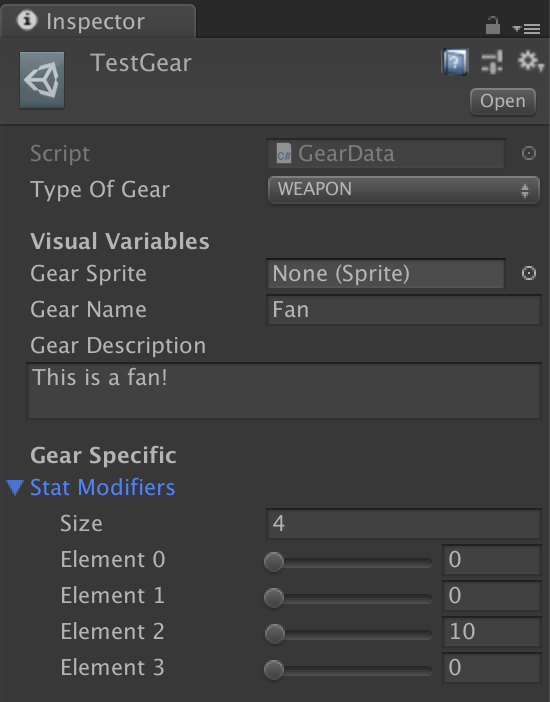
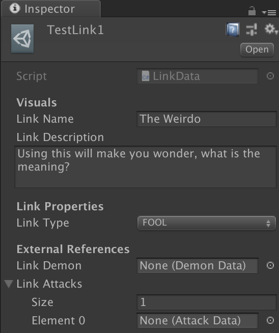

# Database Data Types
This documentation goes over all of the various data types that exist in the game.

## Summary

This game will have numerous custom GameObjects that will represent unique information about specific objects (attacks, enemies, players, etc). In order to streamline this creation, the project organizes all of these specific data points into custom `Scriptable Objects`. Here is a brief list of all of these custom data objects so far:
- `AttackData`
- `CharacterData`
- `EnemyData`
- `ItemData`
- `DemonData`
- `GearData`
- `LinkData`

All of these data types will be instanciated into objects into the game when approperiate.

## Attack Data

This defines all of the attacks that are in the game.
- `Attack Name`: The name of the attack that will be displayed when it is used.
- `Attack Description`: A short description of the move that the player can read when they have this move selected.
- `Attack Animation`: A reference to an animation that will play when this attack is played out.
- `Attack Type`: All attacks fall into three major categories, which affect its damage calculation and effects:
  - `Physical`: Moves that use the `Attack` and `Defense` stats.
  - `Special`: Moves that use the `Special Attack` and `Special Defense` stats.
  - `Staus`: Moves that cause buffs, debuffs, and status aliments.
- `Attack Affinity`: All moves also have a specific element (affinity) that is attached to it. These determine weaknesses and resistances. There are 8 affinities in the game:
  - `Fire`
  - `Ice`
  - `Wind`
  - `Thunder`
  - `Light`
  - `Dark`
  - `Almighty`
- `Attack Cost`: How much HP/SP does this attack need to use? Which pool it takes from depends on the `Attack Type` of the attack.
- `Attack Power`: The base power of the attack. This will be calculated along with affinities, stats, and buffs/debuffs.

### Attack Affinities
Depending on the receiver's `Affinity Values`, an attack can be more/less effective. The values of this are described below:
  - `NORMAL`: The enemy does not take any more or any less damage
  - `WEAK`: The enemy takes extra damage against that attack
  - `RESISTANT`: The enemy takes less damage against that attack
  - `NULL`: The enemy takes no damage against that attack
  - `ABSORB`: The enemy heals when an attack of this affinity hits it
  - `REFLECT`: The enemy sends the attack back at the sender

NOTE: __As stated in the source code, each array index in the `Affinity Values` corresponds to a specific Affinity.__  The chart for that is shown below:
  - 0: CONTACT
  - 1: FIRE
  - 2: ICE
  - 3: WIND
  - 4: THUNDER
  - 5: LIGHT
  - 6: DARK
  - 7: ALMIGHTY

## Character Data

This defines all of the character traits that are for a specific character.
- `Character Name`: The name of the character that will be displayed in UIs.
- `Max Health Points`: The maximum amount of health a character can have. (Max: 9999, Min: 0)
- `Max Skill Points`: The maximum amount of skill points a character can have. (Max: 9999, Min: 0)
- `Base Attack`: How much power does this character have when executing any move? (Max: 1000, Min: 0)
- `Base Defense`: How much resistance does this character have when being hit by any move? (Max: 1000, Min: 0)
- `Demon Data`: The specific `Demon Data` that this character has equipped? This demon will also base all of the character's other stats, moves, and affinities.
- `Equippable Gear`: The gear slots that the player can have. The player can only equip 3 gear items at a time, each gear being a different type.

## Enemy Data

This defines all of an enemy's trait.
- `Enemy Sprite`: The current sprite the enemy is using
- `Enemy Name`: The name of the enemy that will be showin in UIs.
- `Max Health Points`: The maximum value of health an enemy will have. (Max: 15000, Min: 1)
- `Max Skill Points`: The maximum value of skill points an enemy will have. (Max: 15000, Min: 1)
- `Phy Attack Stat`: How much attack power does this enemy have? (Max: 9999, Min: 1)
- `Phy Defense Stat`: How much defense does this enemy have? (Max: 9999, Min: 1)
- `Sp Attack Stat`: How much special attack power does this enemy have? (Max: 9999, Min: 1)
- `Sp Defense Stat`: How much special defense does this enemy have? (Max: 9999, Min: 1)
- `Spd Stat`: How much speed does this enemy have? (Max: 9999, Min: 1)
- `Luck Stat`: How much luck does this enemy have? (Max: 9999, Min: 1)
- `Affinitiy Values`: An array of all of the affinities that the enemy has towards attacks. Each affinity has a specifi `Affinity Value`, determining the special bonus the enemy gets when hit by a specific move:
- `Attack List`: A list of all of the attacks that are available to the enemy.

## Item Data

This defines all of the items that are in the game.
- `Item Sprite`: What sprite does this item correspond to?
- `Item Name`: The name that will be displayed in the menus for this item.
- `Item Description`: A short description of what this item does. This is also displayed in menus.
- `Item Type`: All items fall under three categories, with this determing its function and usage.
  - `HP`
  - `SP`
  - `KEY_ITEM`
- `Item Amount`: How much HP/SP will this restore when used?

## Demon Data

This defines all of the key traits that a demon has.
- `Demon Name`: The name of the demon that is displayed in the UI.
- `Phy Attack Stat`: How much attack power does this demon have? (Max: 9999, Min: 1)
- `Phy Defense Stat`: How much defense does this demon have? (Max: 9999, Min: 1)
- `Sp Attack Stat`: How much special attack power does this demon have? (Max: 9999, Min: 1)
- `Sp Defense Stat`: How much special defense does this demon have? (Max: 9999, Min: 1)
- `Spd Stat`: How much speed does this demon have? (Max: 9999, Min: 1)
- `Luck Stat`: How much luck does this demon have? (Max: 9999, Min: 1)
- `Affinitiy Values`: An array of all of the affinities that the demon has towards attacks. Each affinity has a specifi `Affinity Value`, determining the special bonus the demon gets when hit by a specific move:
- `Attack List`: A list of all of the attacks that are available to the demon.

## Gear Data

This defines all of the key traits for gear that the player can equip.
- `Type Of Gear`: All gear fall under three categories. Depending on what type of gear selected, the player can only equip one of each category at a time.
  1. Weapon
  2. Armor
  3. Accessory
- `Gear Sprite`: The sprite that is displaed in the UI when selecting this gear.
- `Gear Name`: The name of the gear that is displaed in the UI.
- `Gear Description`: A short sentence describing what this gear item is and what it does.
- `Stat Modifiers`: An array that correlates to the player's core stats. Each index points to a specific stat in the player. A chart of it is follows:
  - 0: HP
  - 1: SP
  - 2: Attack
  - 3: Defense

## Link Data

This goes over all of the information that goes into a Link.
- `Link Name`: The name of the link that will be displayed in the UI.
- `Link Description`: A short description of the kind of link this is
- `Link Type`: In the game, there are over 18 different types of links. These are based off of Tarot cards, and the player can only have one of each type in their possession.
  1. JESTER
  2. FOOL
  3. MAGICIAN
  4. PRIESTESS
  5. EMPRESS
  6. EMPEROR
  7. LOVERS
  8. CHARIOT
  9. JUSTICE
  10. HERMIT
  11. FORTUNE
  12. HANGED_MAN
  13. TEMPERANCE
  14. DEVIL
  15. TOWER
  16. STAR
  17. MOON
  18. SUN

- `Link Demon`: The specific demon that is associated with this link. This is usually equipped by the player.
- `Link Attacks`: Special attacks that are specific to using this link are displayed here.
