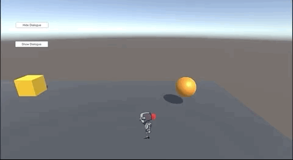
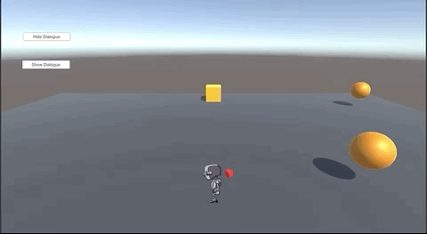
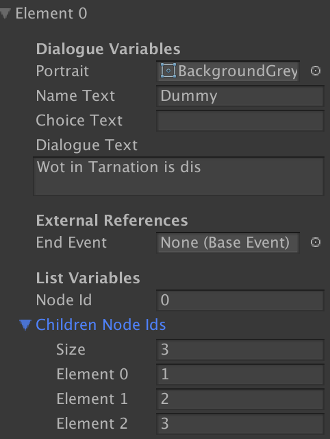
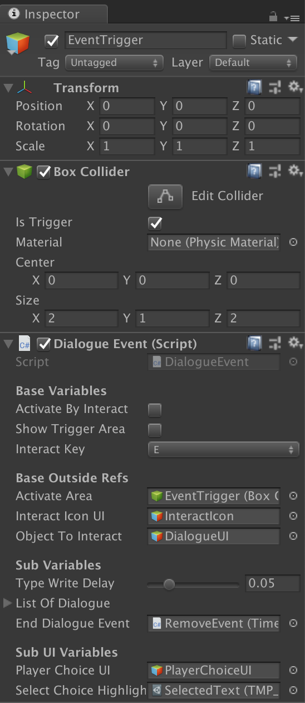

# Dialogue System
This documentation will cover how the dialogue system is implemented in the game.

## Summary

Dialogue is the action of the player either walking up to an individual and interacting with them or simply approaching the individual. During the conversation, the player can choose to fast forward the typescript and continue to the next line of dialogue.

Sometimes, the player is given a prompt, in which they will have to select from a list of options in order to continue. When the dialogue ends, the player moves on with whatever they were doing.

### Dialogue Node
This is the core piece of all dialogue interactions. These are specific data types that encapsulate key components of all dialogues and offer methods and variables to help organize their information.

These nodes can be found in the `List Of Dialogue` in the `Dialogue Event` script.

#### Variables In Dialogue Node
- `Portrait`: What is the current sprite used in the portrait of the dialogue UI?
- `Name Text`: What is the name of the individual speaking in the dialogue?
- `Choice Text`: This is the text that is shown when this dialogue is apart of a decision choice in another dialogue. When the player selects this choice text, it will refer to this dialogue node.
- `Dialogue Text`: This is the main area of dialogue that is shown to the player. This is displayed in a typewriter format.
- `End Event`: This is a reference to a `BaseEvent` that will be activated upon the start of this dialogue.
> Note: The player will be unable to proceed with the dialogue until this event has completed.

- `Node Id`: A numerical value that represents this node in the list of dialogue nodes. This is used to reference specific nodes in the list, and should be __UNIQUE__ numbers, like index points.
> Note: This value cannot be a negative number!

- `Children Node Ids`: An array of all of the `Node Id` that this dialogue node has a reference to. The behavior of this node changes depending on the length of this array:
  - If there's *nothing* in this, the dialogue will terminate, __even__ if there's other dialogue nodes past this node.
  - If there's *only one* value in this, the dialogue will continue to that specified dialogue node's id.
  - If there's *more than one* value, this dialogue node will become a __choice point__, where the player won't proceed with the dialogue until they select an option from the given child node id's `choice text`.

## Dialogue Event Script
This outlines all of the values and references needed in order to make a new `Dialogue Event` in the level.

For most use cases, the GameObject that is hosting the Dialogue Event should look something like this.
- The Parent GameObject can be anything, a model for most instances.
- The fist child should be the GameObject that contains:
  - A `BoxCollider` that has `isTrigger` to be true and whatever size you need the trigger to be
  - The `DialogueEvent` component

This script handles all of the logic in setting up the dialogue system. There's only a few things that needs to be set up immediately for all `DialogueEvents`, regardless of what they are:
- `Activate Area`: Should be the `BoxCollider` component that is attached to this same GameObject.
- `Object to Interact`: Should be the `DialogueUI` that is in the scene that encapsulates all of the dialogue UI.
- `Player Choice UI`: Should be the `PlayerChoiceUI` that is in the main UI.
- `Select Choice Highlight`: Should be the `TMP_Gradiant` that you made in the project. This is used to highlight the selected text that the player is on while making a choice.

#### Variables
- `Type Write Delay`: How long does it take to do the typewriter effect on the dialogue characters?
- `End Dialogue Event`: Once the dialogue is finished, does the `Dialogue Event` do one last event before exiting?
- `List Of Dialogue`: A list of `DialogueNodes` that make up the dialogue. This list does NOT have to be ordered in the order of how the dialogue proceeds.
