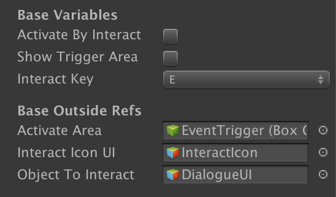

# Events
This documentation goes over how events would work in the game.

## Summary
All events inherit from the class, `Base Event`, which has a multitude of useful variables and methods that allow for the extended use of actions that can happen when the player is around them.

### Variables
- `Activate By Interact`:
  - If __on__, the only way to activate this event is to be within the `Activate Area` that is attached to this GameObject and pressing the specified `Interact Key`.
  - If __off__, the player can simply walk into the `Activate  Area` trigger and the event will automatically play out.
- `Show Trigger Area`: If toggled, will show the size of the trigger that is used to mark the `Active Area` in the Scene Viewer.
- `Interact Key`: Specified what key to use when interacting with this event.
- `Active Area`: Reference to the component that controls the trigger zone of the event.
- `Interact Icon UI`: Reference to the GameObject that controls the icon that displays when the player is within range of the GameObject to interact.
- `Object To Interact`: __IMPORTANT__! This holds a reference to the specific GameObject that is used in activating the event. This GameObject will become active when the event is triggered, so all logic will need to conform to that.

## How To Use:
Events have two ways of getting toggled:

1) Interacting with them using the `Interact Key` while in the `Active Area`

2) Entering the `Active Area` when the event has not been triggered already.

> NOTE: Events by default will keep on being active, even after being done. To stop this behavior, you can associate the event with a `Timed Removal Event` so that the GameObject associated with the event will be removed after interacting with it.
