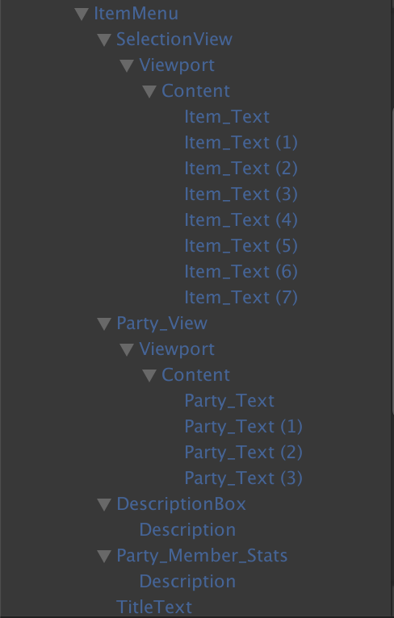

# Pause Menu

This is the documentation for how to utilize the Pause Menu in the game and how it is set up.

> This section will be expanded on greatly as the project continues, especially when new features for the menu are implemented.

## Summary

When the player presses the `Q` key, the Pause Menu will open up after a quick transition. From here, the player is free to scroll through all of the available options and select one of them. They can back out of an option as well as close the menu entirely.

When the player is selecting a choice, it will be highlighted in a different color from the rest of the options.

#### Controls
- `Q`: Open/Close the Pause Menu (Can only close menu IF user is on the Main Menu part)
- `W/S OR Up Arrow/Down Arrow`: Scroll through options
- `E`: Confirm
- `R`: Cancel/Return (If at the Main Menu part, will close the Pause Menu)

## Setting Up
The Pause Menu is one giant GameObject that contains multiple GameObjects encapsulating all of the UI elements that make up each section of the Pause Menu.

As displayed here, the PauseMenu contains 5 GameObjects that make up their respective options. The next sections will go over their setup and function.

### Main Menu
This is what first shows when the player opens the Pause Menu. Here, the player can select from a list of options that will take them to the respective menus.

### Item Menu

This is where the player can examine and use an item that is in their inventory. When the player has items in their inventory, they are able to freely select any of them in this menu. Once they select an item, they are treated to this view:

Here, the player can not only see who is currently in their party, but also shows that character's individual stats. Upon selecting the character the following happens:
1. The item is used
2. The selected character's HP or SP is restored
3. If there is more of said item, the player is free to use another one of the same item. If not, they are moved back to the item selection menu.

As shown here, all of the items will be displayed in the `Context` GameObject that is in the `SelectionView` GameObject. Later down the line, this will be dynamically updated to list out more than the number of items that are currently in there.

The `DescriptionBox` GameObject will display useful information to the player given the context of what the player is currently doing in that menu.

The `PartyView` holds all of the information of the current player party.

The `PartyMemberStats` displays the highlighted party member's HP and SP. This will be updated automatically when an item is used on a party member.

### Party Menu
__SCREENSHOTS AND GIF TO BE ADDED LATER__

This section will allow the player to view and organize the current active party members. Here, you can also check the social status of the MC too.

### Gear Menu
__SCREENSHOTS AND GIF TO BE ADDED LATER__

This section will allow the player to setup and view all of the equipment that they have gathered in the game.

### Link Menu
__SCREENSHOTS AND GIF TO BE ADDED LATER__

This section will allow the player to view all of their Links that they made during the game as well as see how close they are into leveling it up. They can also view the specific bonuses that are granted to the MC when equipping them in battle.

## Pause Menu Controller
This is what ties all of the Pause Menu together. All of the core funtionality as well as establishing each menu's function will be defined here.

Prereqs:
1. This script should be *SEPERATE* from the `GameManager` GameObject. It should be by itself in another GameObject.
2. The script needs to know  the `GameObject` that contains all of the PauseMenu UI. In this case, it is called `PauseUI`, which is a prefab that was dragged into the scene.
3. The script will need a predefined `TextMeshProGUI_Gradiant` resource. This is used to highlight the selected text in the menus.
> All of the inputs are already predefined as defaults. If you were to change them, make sure to change the names of the default inputs here to match the ones that are new.
