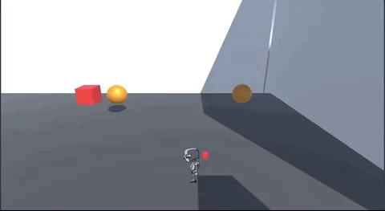
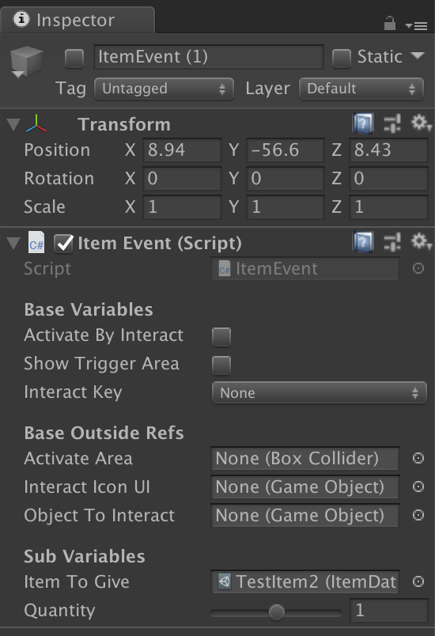
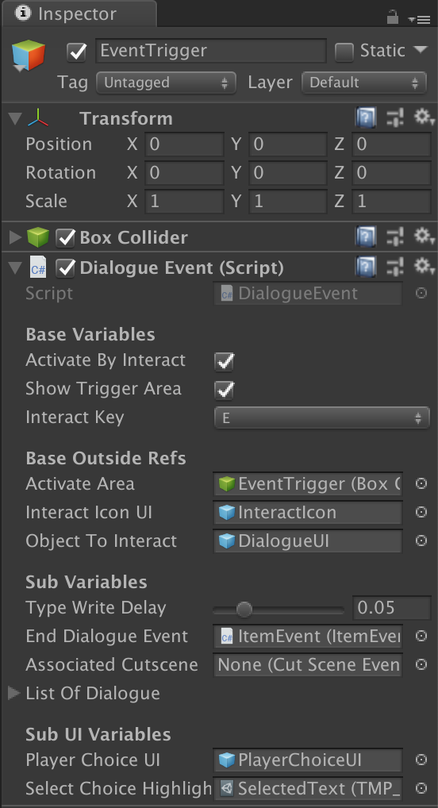

# Player Inventory
This documentation will go over how the player inventory works on a high level.

## Summary

During the game, the player may receive items from either scripted events, dialogues, after battles, etc. When this happens, the item will automatically be sorted by the type of item it is. Each item will have its own use cases and how they are displayed in the Pause Menu.

There are 4 types of items that the player can have:
- `Items`: Consumables that can be used to heal the player and party of their HP, SP, or be used in quests.
- `Party`: An individual that is playable in battles. They have their own stats, affinities, and attacks.
- `Gear`: Equippable items that augment a character's stats during battle. Some can give secondary effects.
- `Links`: Relationships that the player has made with either NPCs or their own party members. These grant the player unique characteristics based on the type of link.

## How to Add/Remove Items
In order for the player inventory to be filled with a specific item, `Item Event` must be invoked on a GameObject.

Noted Characteristics:
- These GameObjects are empty, only having the `Item Event` component.
- These GameObjects are inactivated at the start.
- __ONLY__ the sub variables need to be filled out. All of the Base Variables can be left empty.

#### Variables
- `Item To Give`: Takes a `Scriptable Object` as a parameter, usually a reference to the specific Database Data that you want to make an item out of.
- `Quantity`: An integer number that goes from -99 - 99. This value is only used if the type of the Database Data is either `Item` or `Gear`. Anything else, this value is ignored.
  - To increment the amount that is in the player inventory, make this value be the _number_ of _additional_ items that you want to add.
  - To decrement the amount that is in the player inventory, make this value not only _negative_, but also the amount to _take away_ from the player.

To activate this, another GameObject needs to simply set this GameObject to `Active`, as seen in this example:

In this case, note that the `End Dialogue Event` parameter takes an `Item Event`, meaning at the end of the dialogue, this GameObject will be set active.
